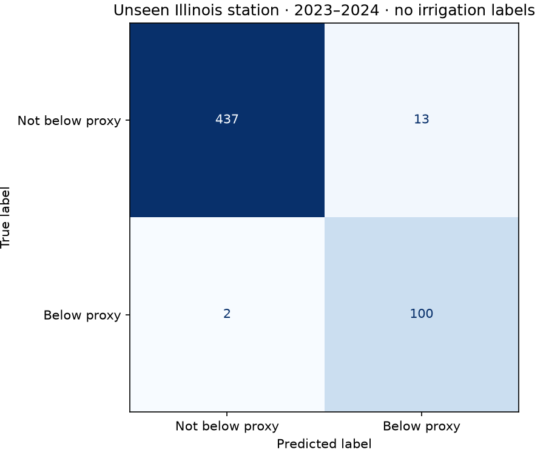
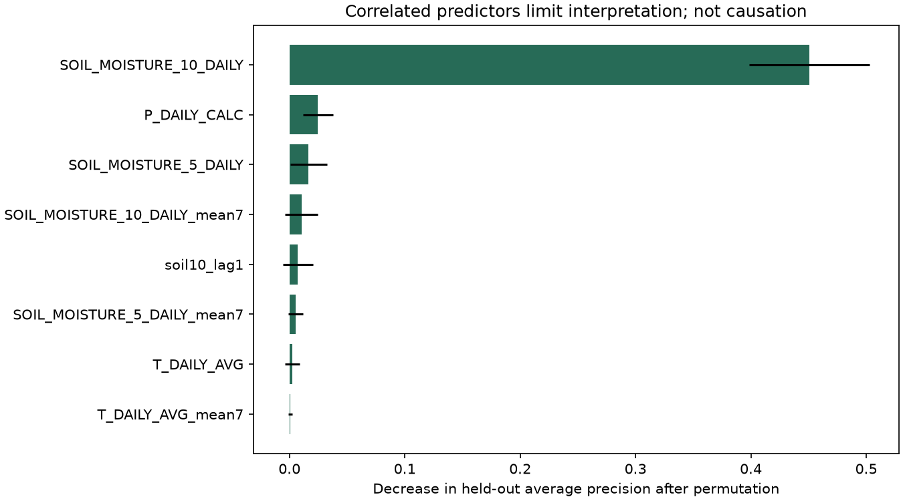

# Smart Irrigation ML — Measured Soil Screening

Predict a next-day **shallow-soil moisture proxy**, with an unseen-station test and a persistence baseline. No observed irrigation decisions or crop-stress labels are available.



## Problem and scope

An irrigation research system needs trustworthy soil measurements before decision rules. This project predicts whether tomorrow's measured moisture at 10 cm will be below a predefined exploratory threshold, **0.20 m³/m³**. That threshold is not a crop-specific wilting point or an agronomic prescription. NOAA sites are reference stations, not verified irrigated farm plots. No water savings, yield benefit or irrigation accuracy is claimed.

## Dataset

Real [NOAA USCRN daily observations](https://www.ncei.noaa.gov/pub/data/uscrn/products/daily01/), 2016–2024: Iowa Des Moines 17 E, Missouri Chillicothe 22 ENE, Illinois Champaign 9 SW. **9,864 source rows**, 8,230 retained with observed current and next-day shallow soil measurements. Inputs: measured 5/10 cm moisture (m³/m³), precipitation (mm), air temperature (°C), relative humidity (%), solar radiation (MJ/m²/day), past lags/rolling means and cyclic day-of-year.

Daily records follow local standard time. Sentinel missing values and invalid physical ranges are masked before labels. Targets are never imputed. Missing/frozen-soil periods can bias retained season coverage. [Source hashes](data/source-manifest.json), [field definitions](data/source-headers.txt), [official format](https://www.ncei.noaa.gov/pub/data/uscrn/products/daily01/readme.txt) and [data notes](data/README.md) preserve provenance. NOAA-produced observations are public domain in the United States under [NCEI's Open Data Policy](https://www.ncei.noaa.gov/sites/default/files/2023-12/NCEI%20PD-10-2-02%20-%20Open%20Data%20Policy%20Signed.pdf). Code is MIT; source terms remain separate.

## Leakage controls and workflow

```text
Hash-verified station files → daily calendar / missing-value handling
→ features available through origin t → next-day observed threshold proxy
→ station/time splits → train-only imputation → validation model/threshold selection
→ unseen-station test → probabilities, error analysis and local inference
```

Train: Iowa/Missouri target dates through 2021; validation: 2022 at those stations; test: **Illinois only, 2023–2024**. Split sizes: {'train': 3971, 'validation': 323, 'test': 552}. No Illinois row enters training or selection. Iowa contributes only three observed one-day pairs in validation year 2022; Missouri dominates validation coverage. This selective seasonal/site coverage limits model-selection evidence. Station identity is excluded. Features include origin-day measurements, never tomorrow's weather. This is retrospective end-of-day forecasting: operational availability and source revision latency are unverified.

Compare current-status persistence, standardized balanced logistic regression, and balanced Random Forest (160 trees, depth 10, leaf minimum 5, seed 42). Fit imputation/scaling only on train. Select probability thresholds from the fixed 0.1–0.9 grid on validation, then select the method by validation positive-class F1. No refit or reselection after test inspection. A persistence method may legitimately win; the inference contract supports that case.

## Executed results

| Method | Validation F1 | Test positive F1 | Test recall | Test precision | Test PR-AUC | False alarms |
|---|---:|---:|---:|---:|---:|---:|
| persistence | 0.9677 | 0.9118 | 0.9118 | 0.9118 | 0.8476 | 9 |
| logistic | 0.8889 | 0.9163 | 0.9118 | 0.9208 | 0.9638 | 8 |
| random_forest | 0.9684 | 0.9302 | 0.9804 | 0.8850 | 0.9508 | 13 |

Selected: **random_forest**, probability thresholds: `{'logistic': 0.8, 'random_forest': 0.5}`. Test has 552 observed rows and 102 below-proxy events (18.5%). The Random Forest catches more below-proxy events but creates more false alarms than persistence. These are threshold crossings in sensor data, not validated irrigation needs. PR-AUC here is sklearn average precision.



Permutation importance measures loss in held-out average precision, with five permutations. Correlated moisture measurements limit attribution; it does not establish causality. Full [metrics](reports/metrics.json) and [per-day predictions](reports/test-predictions.csv) are inspectable.

## Reproduce

Python 3.12, in the local source clone or eventual daily GitHub release:

```bash
python -m venv .venv
# Activate .venv using your platform's command.
python -m pip install -r requirements-lock.txt
python -m pip install --no-deps -e .
python -m irrigation.train
python -m irrigation.predict
python -m pytest -q
```

Acquisition downloads 27 small public text files and verifies pinned hashes. If NOAA revises a file, it fails explicitly instead of silently changing the study. Local raw data and trained artifacts are ignored in Git; the supplied source ZIP reproduces them. Load joblib only from trusted artifacts trained locally by this repository. Example input is a real held-out row with missing values represented as null; exact feature names, finite values and moisture ranges are checked.

`src/irrigation` contains source handling, features, training and inference. `configs` fixes choices before testing. `reports` stores actual outputs; `tests` checks calendar gaps, historical rolling windows, next-day targets, station overlap and inference. [Executed notebook](notebooks/01_evidence.ipynb), [verification](docs/verification.md), [French learning guide](docs/learning-guide.md), [interview notes](docs/interview-notes.md), [design](docs/design.md).

## Limitations and improvements

Shallow moisture differs from root-zone available water. Crop, soil retention curve, field capacity, rooting depth and actual irrigation are unknown. Serially correlated days reduce independent sample size; no confidence interval or water-saving estimate is claimed. The station holdout is only one location and missingness is selective. Obtain independent farm measurements and observed decisions, define crop-specific thresholds, and evaluate decision costs before extending this screening demonstration to an irrigation tool.

Developed with AI assistance. All metrics come from executed observations. External deployment and public CI are pending daily publication.
